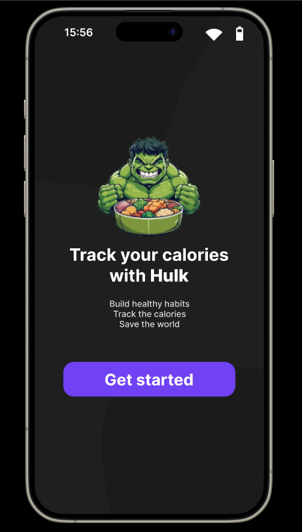
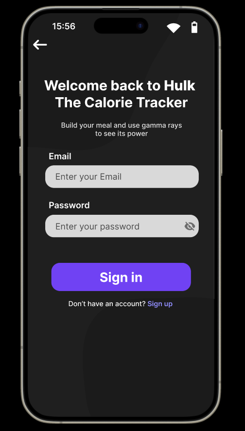
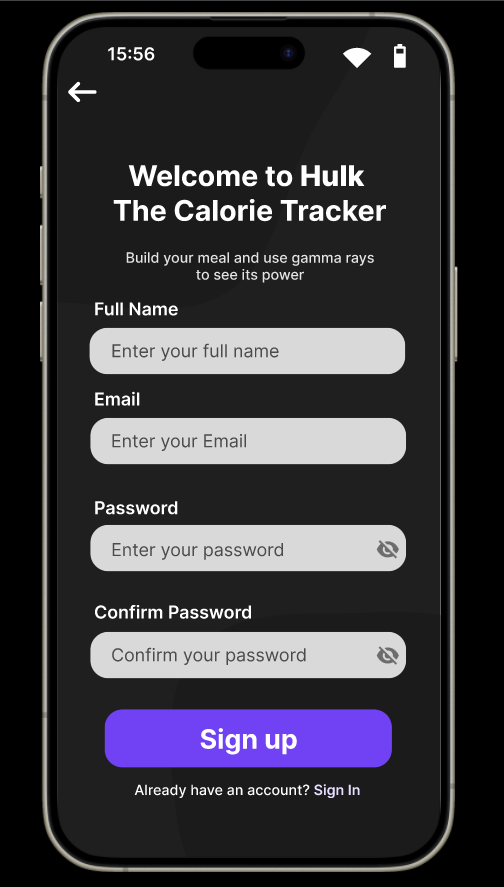
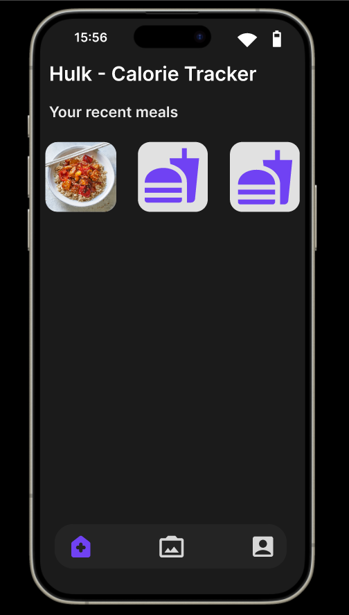
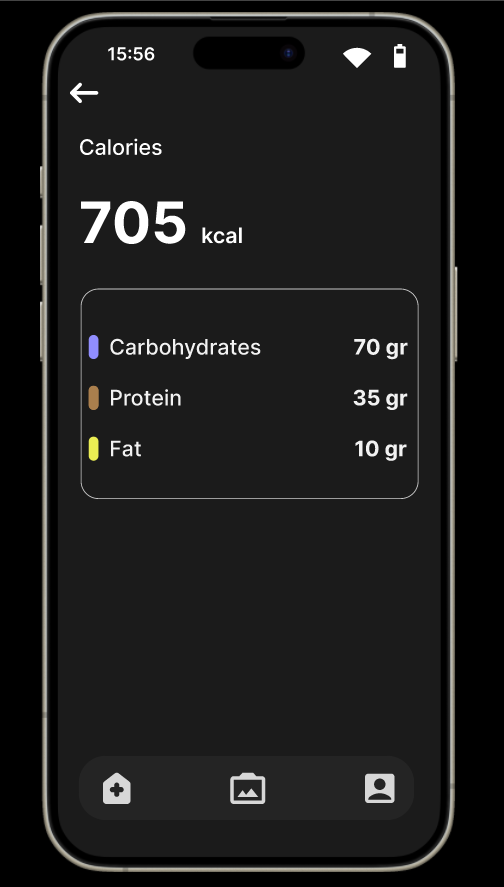
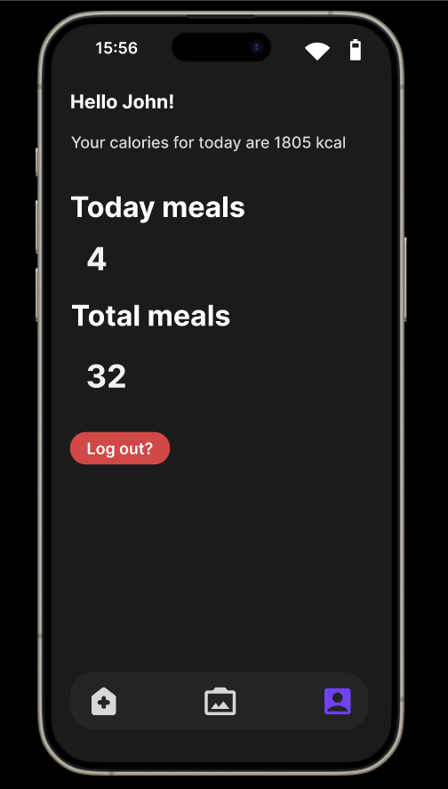

# Hulk - Calorie Tracker
**Hulk** is an easy-to-use mobile application made with React Native for tracking the calories of your meal

## Status
- [x] Finished the prototype in Figma 
- [ ] Code the app (more details soon)
## Figma preview

### Landing page

### Sign In page

### Sign Up page

### Home page

### Meal page

### Profile page

