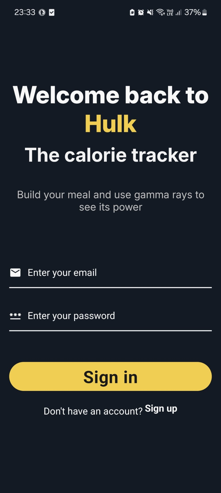
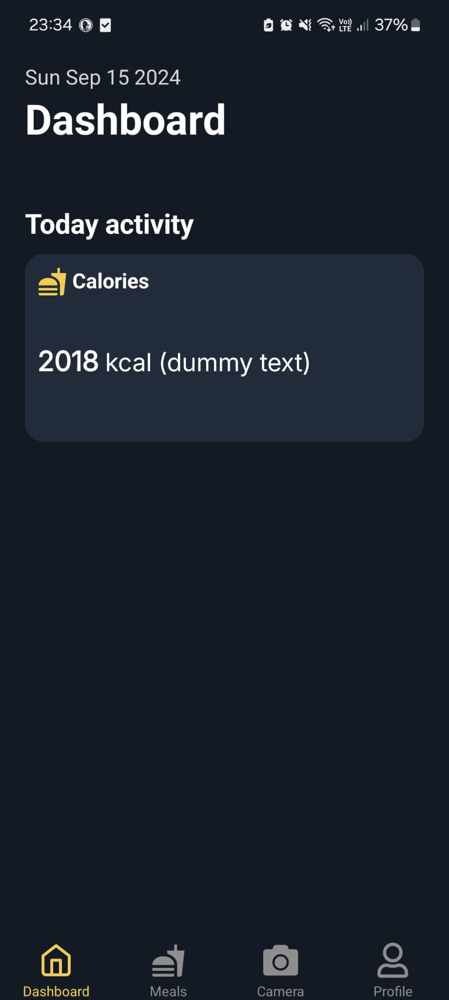
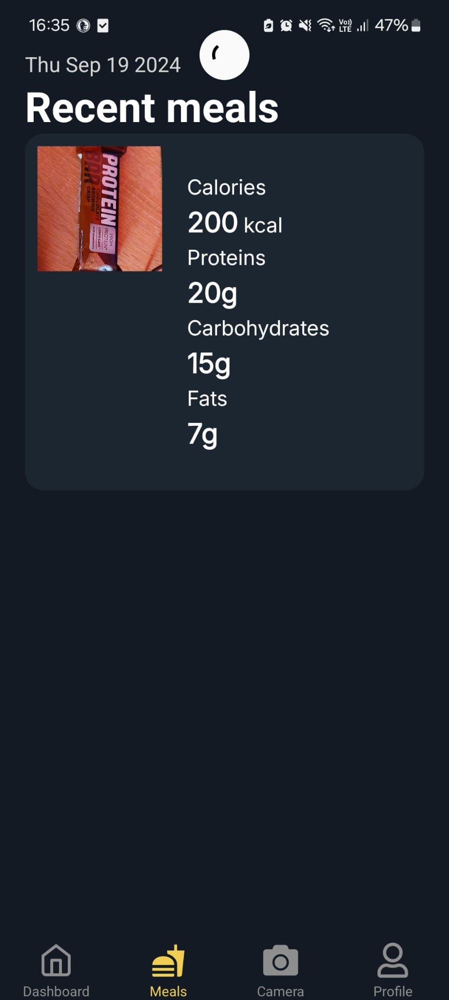
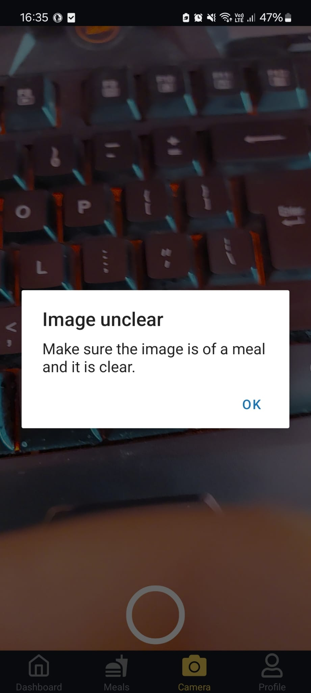
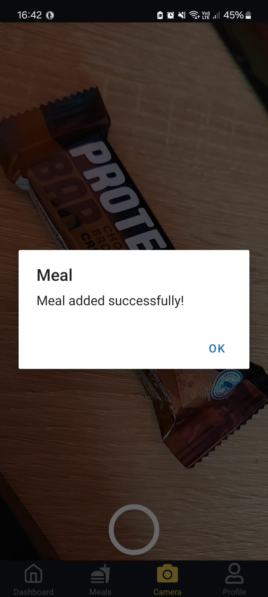
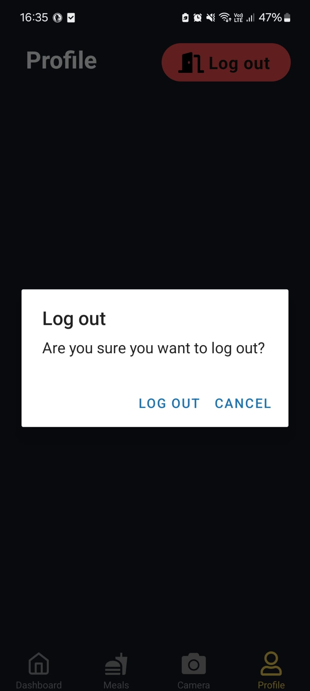

# Hulk - Calorie Tracker
**Hulk** is an easy-to-use mobile application made with React Native that uses Artificial Intelligence for tracking the calories of your meals

## Status

- [ ] Display on home screen the calorie/protein/carb/fat intake for the current day
- [ ] Add statistics
- [ ] Figure out what to add on the profile screen

## Current preview

### Landing

### Home

### Meals
The reload icon appears when you refresh the page to display meals that have been added recently

### Camera
If the image is not perceivable then an alert pops out

After you add a meal another alert pops out

### Profile

## Technologies
- React Native (0.74.3)
- OpenAI API (GPT-4o mini)