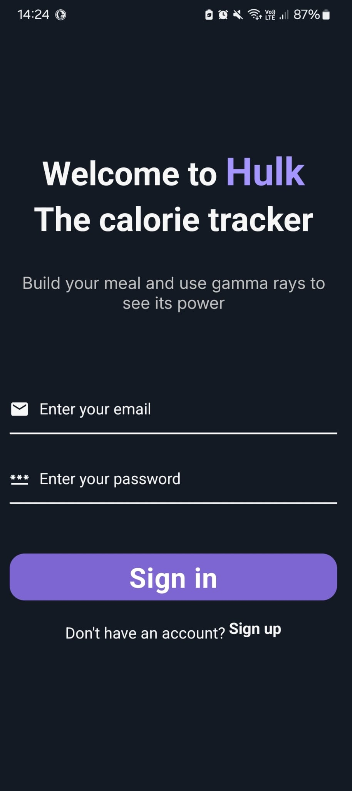

# Hulk - Calorie Tracker
**Hulk** is an easy-to-use mobile application made with React Native for tracking the calories of your meal

## Status
- [x] Finish the prototype in Figma 
- [x] Add the connection with Firebase
- [x] Add a basic auth system (sign in, sign up, log out)
- [x] Create the landing page
## Current preview

### Landing page

### Sign In page

### Sign Up page

### Home page

### Meal page

### Profile page

